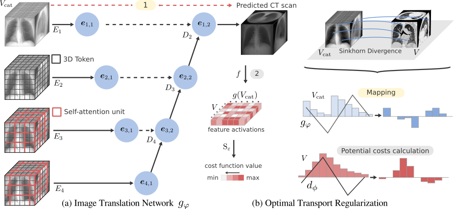

This is the official code for the CVPRW-DCA in MI 2024 paper "Repeat and Concatenate: 2D to 3D Image Translation with 3D to 3D Generative Modeling"



## Usage
Install the dependencies in the requirements.txt. Download and preprocess the data and execute:
```
python ot_train_3d.py --config ./experiments/CONFIG.yaml --cuda
```

## Datasets
For the in-of-distribution dataset, refer to the publicly available [LIDC-IDRI dataset](https://wiki.cancerimagingarchive.net/pages/viewpage.action?pageId=1966254). We preprocessed the CT scans following the instructions in the [X2CT-GAN repo](https://github.com/kylekma/X2CT), and resampled the voxel grids into a 64x64x64. You can scale to a higher resolution if you have access you a bigger GPU. For the 2D projections we used Plastimatch and followed the instructions in the [MedNeRF repo](https://github.com/abrilcf/mednerf) setting a wider Hounsfield unit range of -1,000 HU to +1,000 HU. We performed this same process for the rest of the datasets (out-of-distribution). Refer to [The Cancer Imaging Archive](https://www.cancerimagingarchive.net/browse-collections/) to download such datasets.

## BibTeX

```
@inproceedings{coronafigueroaa24repeat,
 author={Corona-Figueroa, Abril and Shum, Hubert P. H. and Willcocks, Chris G.},
 booktitle={Proceedings of the 2024 IEEE/CVF Conference on Computer Vision and Pattern Recognition Workshops (CVPRW)},
 series={CVPRW '24},
 title={Repeat and Concatenate: 2D to 3D Image Translation with 3D to 3D Generative Modeling},
 year={2024},
 publisher={IEEE/CVF},
 location={Seattle, USA},
}
```
